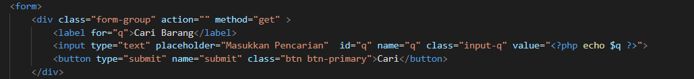

# Lab12web
# Risyad Bima Nugraha
# 312110039
# TI.21.B1
## Membuat Pencarian Data

Untuk membuat pencarian data, yang perlu di perhatikan adalah penggunaan filter pada query data.
 
Pada data awal, query untuk menampilkan semua data adalah:
 
$sql = “SELECT * FROM data_barang”;

 

untuk menambahkan pencarian, maka query tersebut harus ditambahkan klausa WHERE sebagai filter, sehingga menjadi:
 
$sql = “SELECT * FROM data_barang WHERE nama = ‘{$var_nama}’”;
 
Atau dapat juga menggunakan LIKE seperti berikut:
 
$sql = “SELECT * FROM data_barang WHERE nama LIKE ‘{$var_nama}%’”;
 

Prosses Selanjutnya Membuat Form Pencarian

Sisipkan kode tersebut pada file index.php (daftar barang), sebelum table data dan sesudah tombol
tambah data

Hasil Dari Proses Tersebut

Hasil Dari Melakukan Pencarian

# TERIMAKASI
